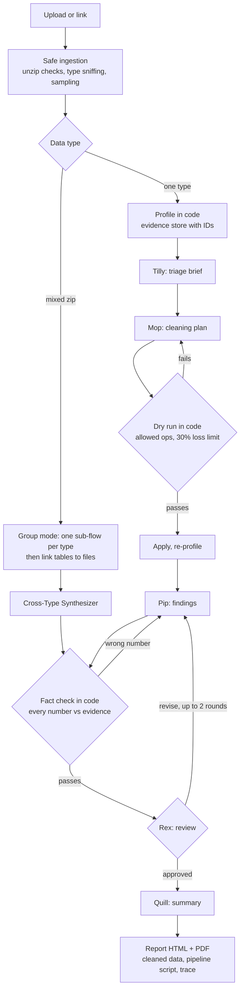

# MOSAIC EDA

**Multimodal Orchestrated System for Analysis, Inspection & Cleaning**, a project by Aliza Saadi.

A crew of AI agents, built with [CrewAI](https://www.crewai.com/), that cleans, explores, and
fact-checks any dataset: tables, text, logs, images, audio, and video, or a zip of them.
Code does every calculation; the agents plan, interpret, and explain, and every number they
state is checked against the evidence before you see it.

**[Try it on Hugging Face](https://lizconquers-mosaic-eda.hf.space)** (free; the replays
need no quota) · **[Evaluation](docs/EVALUATION.md)** ·
**[Design blueprint](docs/MOSAIC-EDA-Blueprint.pdf)**

<!-- EVAL-SUMMARY:START -->
## Evaluation

**68 of 83 planted problems found (82%)** across 10 datasets; 37 of them (45%) were reported by the agents in a finding or the summary. The analyst's first findings passed the fact check in 3 of 10 runs; 96 numbers were fact-checked; 8 review revisions in total; 11 warning or critical findings matched no planted problem. Average 10.8 model calls and 66 s per run on the Gemini free tier.

| Golden dataset | Type | Planted problems found | Model calls | Time |
|---|---|---|---|---|
| sales table | table | 9/9 | 6 | 41 s |
| european orders | table | 5/6 | 11 | 113 s |
| shapes images | image | 11/11 | 7 | 31 s |
| speech audio | audio | 10/11 | 9 | 67 s |
| support text | text | 9/11 | 9 | 37 s |
| pattern video | video | 9/11 | 8 | 132 s |
| shapes mixed | mixed | 5/6 | 26 | 63 s |
| server log | table | 3/4 | 6 | 23 s |
| hr attrition | table | 5/9 | 13 | 97 s |
| sensor series | table | 2/5 | 13 | 52 s |

What it catches, what it misses, and how it was measured: [docs/EVALUATION.md](docs/EVALUATION.md).
<!-- EVAL-SUMMARY:END -->

## What you get

Upload a file or a zip (or paste a link), optionally say what you want to do with the data,
and watch the team work in a small animated office. At the end:

- **A report** (HTML and PDF): findings with severity and evidence, charts, what every
  cleaning step changed, and how the agents checked themselves.
- **The cleaned data**, and **`cleaning_pipeline.py`**, a script that repeats the cleaning
  on the full dataset. Agents choose operations from an allowed list; they never write code.
- **The agents' conversation**: the brief, the plan, the findings, the reviewer's comments,
  and the revisions, as each agent handed work to the next.

| Data | What code measures (examples) |
|---|---|
| Tables (CSV, Excel, JSON Lines, European formats) | types, hidden missing values, duplicates, outliers, target leakage, correlations |
| Logs | levels, errors per service, silences, error bursts, stack traces |
| Text | duplicates and near duplicates, mislabels, encoding damage, HTML, personal data, boilerplate, languages, topics |
| Images | corrupt, blurry, dark, blank, tiny, duplicates across classes, class balance, a vision review |
| Audio | silence, clipping, noise, too short, duplicates, transcripts that contradict labels |
| Video | black, frozen, no audio, rotation, duplicates, scene cuts with per-scene transcripts |
| Mixed zips | each type analyzed by its own crew, then tables linked to files |

## Meet the team

| | Agent | Job |
|---|---|---|
| Tilly | Dataset Triage Lead | Reads the profile first and decides what matters for your goal. |
| Mop | Cleaning Strategist | Plans the cleaning from an allowed list of operations. |
| Pip | Insight Analyst (the Video or Cross-Type Synthesizer in those runs) | Writes the findings; every number is fact-checked. |
| Rex | Senior Reviewer | Checks the reasoning and sends findings back with comments. |
| Quill | Report Writer | Writes the summary you read at the end. |

## How it works



- **A CrewAI Flow** routes each job; each data type has an adapter (profiling, operations,
  export) and its own crew configuration. Mixed zips run a sub-flow per type in parallel.
- **Evidence store.** Every measurement is an artifact with an ID. Agents must cite IDs,
  and the fact check compares every number they state with the cited artifact.
- **Five levels of self-correction:** schema validation, the fact check and dry run as
  task guardrails with retries, a safe-only fallback plan, the review loop, and withholding
  findings that still don't pass (the report says so).
- **Free-tier models.** Two Gemini pools (Flash-Lite for most work, Flash for review)
  with automatic fallback, a quota tracker, a per-job time limit, and a runs-left counter.
  Replays of recorded runs keep the demo working when the quota runs out.

## Safety

- Zips are extracted defensively: path traversal, symlinks, zip bombs (checked from the
  headers and again while streaming), encrypted entries, and deep nesting are refused.
- Links are resolved (Google Drive, Dropbox, Hugging Face, GitHub) but never to private or
  local network addresses.
- **Prompt injection:** text in the data that tries to instruct an AI is found by code,
  reported as evidence, masked in everything the agents read, and can be removed from the
  cleaned data (`mask_injection_text`).
- Exported CSVs neutralize spreadsheet formulas, and personal data is masked in quotes.
- Nothing is kept: jobs are deleted after an hour, and share links are opt-in (reports only).

## Accessibility

Day and night themes, a color-blind mode, and reduced-motion support. Tests simulate
protanopia, deuteranopia, and tritanopia on the chart colors (CIEDE2000) and check WCAG AA
contrast for text (`tests/unit/test_palette.py`).

## Run locally

Requires Python 3.12 and a free [Gemini API key](https://aistudio.google.com/apikey).

```bash
python -m venv .venv
.venv/Scripts/activate        # Windows (macOS/Linux: source .venv/bin/activate)
pip install -r requirements.txt -r requirements-dev.txt
cp .env.example .env          # then add your GEMINI_API_KEY
python -m mosaic.llm.key_check   # one test request per model
python app.py                 # http://127.0.0.1:7860
```

## Tests and evaluation

```bash
pytest              # unit and integration tests with scripted agents (no API calls)
pytest -m live      # also calls the real Gemini API (uses free-tier quota)
ruff check . && ruff format --check .
python eval/evaluate.py   # the golden-dataset evaluation (live, about 100-150 model calls)
```

## Project layout

```
src/mosaic/
  ingest/      safe download, unzip, type sniffing, sampling
  flow/        the CrewAI Flow, per-type adapters, group mode
  crews/       agent and task configuration per data type
  tables/ text/ images/ audio/ video/ mixed/   profiling and cleaning operations
  evidence/    the evidence store
  guardrails/  the fact check and the plan dry run
  llm/         model pools, quota tracking, fallback
  security/    the prompt-injection scan
  reporting/   charts, HTML and PDF reports, share links
  ui/          the Gradio app, the office, replays, reviews
eval/          golden datasets, the evaluation harness, replay recording
```

## Credits

Illustrations: [Highlights](https://www.highlights.design/) by Outdraw Design (CC0).
Built with CrewAI, Gradio, Gemini, pandas, Plotly, and ffmpeg.
