# MOSAIC EDA

**Multimodal Orchestrated System for Analysis, Inspection & Cleaning**, a project by Aliza Saadi.

A team of five AI agents, built with [CrewAI](https://www.crewai.com/), that cleans,
explores, and fact-checks any dataset: tables, logs, text, images, audio, video, or a zip
that mixes them. **Code does every calculation; the agents plan, interpret, and explain;
and every number they write is checked against the evidence before you see it.**

**[Try it live](https://lizconquers-mosaic-eda.hf.space)** (free, no sign-up; the replays
need no quota) ·
**[Full project report](https://github.com/AlizaSaadi/mosaic-eda/blob/main/docs/PROJECT_REPORT.md)** ·
**[Evaluation](https://github.com/AlizaSaadi/mosaic-eda/blob/main/docs/EVALUATION.md)** ·
**[Design blueprint](https://github.com/AlizaSaadi/mosaic-eda/blob/main/docs/MOSAIC-EDA-Blueprint.pdf)**

<!-- EVAL-SUMMARY:START -->
## Evaluation

**72 of 83 planted problems found (87%)** across 10 datasets; 49 of them (59%) were reported by the agents in a finding or the summary. The analyst's first findings passed the fact check in 4 of 10 runs; 110 numbers were fact-checked; 9 review revisions in total; 11 warning or critical findings matched no planted problem. Average 10.9 model calls and 99 s per run on the Gemini free tier.

| Golden dataset | Type | Planted problems found | Model calls | Time |
|---|---|---|---|---|
| sales table | table | 8/9 | 6 | 37 s |
| european orders | table | 5/6 | 11 | 133 s |
| shapes images | image | 10/11 | 10 | 94 s |
| speech audio | audio | 10/11 | 10 | 190 s |
| support text | text | 9/11 | 10 | 106 s |
| pattern video | video | 9/11 | 8 | 139 s |
| shapes mixed | mixed | 6/6 | 24 | 99 s |
| server log | table | 4/4 | 7 | 27 s |
| hr attrition | table | 8/9 | 11 | 50 s |
| sensor series | table | 3/5 | 12 | 111 s |

What it catches, what it misses, and how it was measured: [docs/EVALUATION.md](https://github.com/AlizaSaadi/mosaic-eda/blob/main/docs/EVALUATION.md).
<!-- EVAL-SUMMARY:END -->

## What it does

Upload a file or a zip, or paste a link (Google Drive, Dropbox, Hugging Face, GitHub).
Optionally say what you want to do with the data ("predict which customers churn"). Then
watch the team work in a small animated office, where each agent is a creature that walks
to the next one's room when it hands over work. At the end you get:

- **A report** (HTML and PDF): findings with severity and evidence, charts with labeled
  axes and a one-line reading, what every cleaning step changed (with examples), and how the
  agents checked themselves.
- **The cleaned data** and **`cleaning_pipeline.py`**, a script that repeats exactly the
  same cleaning on the full dataset.
- **The agents' conversation**: the brief, the plan, the findings, the reviewer's comments,
  and the revisions, as each agent handed work to the next.

| Data | What code measures (examples) |
|---|---|
| Tables (CSV, Excel, JSON Lines, European formats) | types, hidden missing values, duplicates, outliers, target leakage, correlations, prompt-injection text |
| Logs | levels, errors per service, silences, error bursts, stack traces |
| Text | duplicates and near duplicates, mislabels, encoding damage, HTML, personal data, boilerplate, languages, topics |
| Images | corrupt, blurry, dark, blank, tiny, duplicates across classes, class balance, a vision review |
| Audio | silence, clipping, noise, too short, duplicates, transcripts that contradict their labels |
| Video | black, frozen, no audio, rotation, duplicates, scene cuts with per-scene transcripts |
| Mixed zips | each type analyzed by its own team, then tables linked to files |

## The team

| | Agent | Job | Model |
|---|---|---|---|
| Tilly | Dataset Triage Lead | Reads the profile and writes a brief: what the data is, what matters for your goal, which column is the target. | Flash-Lite |
| Mop | Cleaning Strategist | Picks cleaning operations from an allowed list, each with a reason and evidence. | Flash, then Flash-Lite |
| Pip | Insight Analyst (the Video or Cross-Type Synthesizer in those runs) | Writes findings; every number is fact-checked. | Flash, then Flash-Lite |
| Rex | Senior Reviewer | Judges severity, overclaiming, causation, and what's missing; sends findings back with comments. | Flash first |
| Quill | Report Writer | Writes the headline, summary, and next steps from the checked findings. | Flash-Lite |

## Architecture

```mermaid
flowchart LR
    subgraph UI["Gradio app"]
        W[Welcome] --> UP[Upload] --> OF[Office<br/>animated agents] --> RS[Results]
    end
    subgraph IN["Safe ingestion"]
        DL[Links: SSRF-safe download] --> ZIP[Zips: bomb and slip checks]
        ZIP --> SN[Type sniffing, sampling, manifest]
    end
    subgraph FLOW["CrewAI Flow (code decides the order)"]
        RT{route} -->|one type| PR[Profile in code]
        RT -->|mixed zip| GR[Group mode:<br/>a sub-Flow per type<br/>then table-to-file links]
        PR --> TR[Tilly: brief]
        TR --> PL[Mop: plan] --> DR{Dry run}
        DR -->|rejected| PL
        DR --> AP[Apply, re-profile]
        AP --> AN[Pip: findings]
        GR --> CX[Cross-Type Synthesizer]
        AN --> FC{Fact check}
        CX --> FC
        FC -->|wrong number| AN
        FC --> RV[Rex: review]
        RV -->|revise, up to 2 rounds| AN
        RV --> QW[Quill: summary]
    end
    subgraph CORE["Shared services"]
        EV[(Evidence store<br/>artifacts with IDs)]
        AD[Adapters per type:<br/>table, log, text, image, audio, video]
        OPS[81 allowed operations<br/>code templates]
        LLM[PooledLLM: Gemini pools,<br/>quota tracker, fallback,<br/>circuit breaker, deadlines]
        SEC[Injection scan, PII masking,<br/>formula neutralizing]
    end
    subgraph OUT["Outputs"]
        REP[Report HTML + PDF]
        CL[Cleaned data +<br/>cleaning_pipeline.py]
        LOG[Agent messages +<br/>trace]
    end
    UP --> IN --> FLOW
    FLOW <--> CORE
    QW --> OUT
    FLOW -. events and messages .-> OF
    OUT --> RS
```



**How a run flows** (one data type):

1. **Ingest safely.** Check the size, unpack zips defensively, and detect each file's type
   from its content.
2. **Profile in code.** Every measurement is saved as an *evidence artifact* with an ID
   (`tbl_columns_001`). No AI has been called yet.
3. **Tilly** reads the evidence and writes a brief for Mop.
4. **Mop** proposes a plan from the allowed operations. Code dry-runs it on a copy and
   rejects plans that remove over 30% of the data, turn over 10% of a column's values into
   missing, fill in over 40% of a column, or distort a distribution.
5. **Code applies the plan and profiles again.**
6. **Pip** writes findings citing evidence IDs. The **fact check** compares every number
   with the cited evidence and sends wrong ones back with a hint.
7. **Rex** reviews the reasoning. Blocking issues go back to Pip (at most two rounds);
   findings still disputed after that are withheld, and the report says so.
8. **Quill** writes the summary, and code renders the report, the cleaned data, the
   pipeline script, and the trace.

**Why it's built this way** (the full reasoning is in the
[project report](https://github.com/AlizaSaadi/mosaic-eda/blob/main/docs/PROJECT_REPORT.md)):

- **A Flow, not a manager agent.** The order of EDA is fixed, so plain code routes the
  work: cheaper, predictable, and testable. Agents only do the parts that need judgment.
- **One-task crews.** Each agent runs as its own small crew so code can run between steps
  and decide what happens next (retry, fall back, revise, stop).
- **Adapters.** Each data type plugs in its own loading, measurement, operations, and
  exports; the agent logic is shared.
- **Structured outputs.** Every agent returns a Pydantic model, so code can validate and
  check every field.
- **Allowed operations, not generated code.** Safe, reproducible, and the exported script is
  exactly what ran.

## Self-correction, in layers

| Layer | What it catches | What happens |
|---|---|---|
| Structured output | malformed answers | rejected with the validation error; the agent retries |
| Triage check | a target that doesn't exist or is an identifier | the brief goes back to Tilly |
| Dry run | destructive, lossy, or invented cleaning | the plan goes back to Mop, naming the step at fault |
| Fact check | a number that doesn't match its evidence, causal claims | the finding goes back to Pip with where the number really is |
| Review loop | overstated severity, overclaiming, missed problems | specific comments go back to Pip, two rounds at most |
| Graceful degradation | retries run out, quota runs out, a model hangs | a safe-only plan, only verified findings (labeled), a 10-minute job limit |

## Built for a free tier

Gemini's free tier allows only 20 requests a day per Flash model. So:

- **Tools first:** all measurement is code, and each agent needs about one call (about 10
  per run).
- **Two model pools:** Flash-Lite for volume, Flash for judgment, with a reserve so the
  reviewer always has Flash.
- **A quota tracker, automatic fallback, a circuit breaker** for overloaded models, a
  45-second call timeout, and a 10-minute job limit.
- **Replays** of recorded runs keep the demo working when the quota runs out.

## Safety

- Zips are unpacked defensively: path traversal, symlinks, zip bombs (checked from headers
  and while streaming), encrypted entries, and deep nesting are refused.
- Links never resolve to private or local network addresses; redirects are re-checked.
- **Prompt injection:** instruction-like text in the data is found by code, reported as
  evidence, masked in everything the agents read, and removable from the cleaned data.
- Personal data is masked in quotes; exported CSVs neutralize spreadsheet formulas.
- Jobs are deleted after an hour; share links are opt-in and share the report only.

## Accessibility

Day and night themes, a color-blind mode, and reduced-motion support. Tests simulate
protanopia, deuteranopia, and tritanopia on the chart colors (CIEDE2000) and check WCAG AA
contrast (`tests/unit/test_palette.py`).

## Tech stack

CrewAI 1.15 (Flow and crews) · Gemini 3.x Flash and Flash-Lite · Gradio 6 · pandas and numpy ·
Plotly and matplotlib · fpdf2 · ffmpeg (imageio-ffmpeg) · faster-whisper and Whisper on
ZeroGPU · Pillow · webrtcvad · Hugging Face Spaces (ZeroGPU) · GitHub Actions

## Run locally

Requires Python 3.12 and a free [Gemini API key](https://aistudio.google.com/apikey).

```bash
python -m venv .venv
.venv/Scripts/activate        # Windows (macOS/Linux: source .venv/bin/activate)
pip install -r requirements.txt -r requirements-dev.txt
cp .env.example .env          # then add your GEMINI_API_KEY
python -m mosaic.llm.key_check   # one test request per model
python app.py                 # http://127.0.0.1:7860
```

## Tests and evaluation

```bash
pytest              # 240+ tests with scripted agents (no API calls)
pytest -m live      # also calls the real Gemini API (uses free-tier quota)
ruff check . && ruff format --check .
python eval/evaluate.py   # the golden-dataset evaluation (live, about 100-150 model calls)
```

## Project layout

```
src/mosaic/
  ingest/      safe download, unzip, type sniffing, sampling
  flow/        the CrewAI Flow, per-type adapters, group mode
  crews/       agent and task configuration (YAML) per data type
  tables/ text/ images/ audio/ video/ mixed/   measurement and cleaning operations
  evidence/    the evidence store
  guardrails/  the fact check, the triage check, the plan dry run
  llm/         model pools, quota tracking, fallback
  security/    the prompt-injection scan
  reporting/   charts, HTML and PDF reports, share links
  ui/          the Gradio app, the office, replays, reviews
eval/          golden datasets, the evaluation harness, replay recording
docs/          the project report, the evaluation, the design blueprint
```

## Credits

Illustrations: [Highlights](https://www.highlights.design/) by Outdraw Design (CC0).
